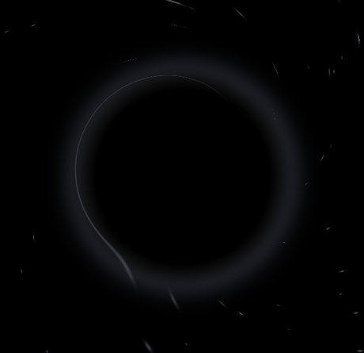

# 001 · 黑洞引力回收站 (Black Hole Trashcan)

把文件拖到窗口里，文件卡片会被黑洞的潮汐力撕成三股光丝，沿旋转方向缠绕坠落、摊开成吸积盘，最后被吞噬殆尽 —— 全程约 3 秒，一条 Metal shader 完成。



## 运行

```bash
cd BlackHole
open BlackHole.xcodeproj   # Xcode 中 Cmd+R
```

拖任意文件到窗口即可触发。

## 核心实现

- **统一物质流场**（`renderStream`）：丝与盘不是两个图层——"丝"是新坠入的物质（窄而炽亮），"盘"是丝的沉积（黏性扩散 `width ∝ √age` 摊开）。撕裂、缠绕、成盘、消散全部由同一个时间函数驱动。
- **连续潮汐撕裂**：不切片、不扇形展开。文件卡片以连续形变场被拉长、变光，28 个切片节点铺瓦 + 48 段弧长表反解保证无缝。
- **引力锚定**：出生点 = 抓取点极坐标直接传入 shader，丝头按 `φ = ω·u^1.45` 螺旋推进，与盘的交接处用时间反演镜像螺旋衔接（C1 连续，无折角）。
- **统一遮挡场（v17）**：洞周只用一条软边界 `occ = smoothstep(1.0Rsh, 1.55Rsh, r)` 全方向压暗，近侧按方位角豁免（前景带可从黑洞前方掠过、遮挡视界下部）。消除了多种抑制轮廓相夹产生的"嵌合体"缺口。
- **多普勒 beaming**：转向观察者的一侧增亮（×3.2），远离侧压暗，吸积盘有真实的不对称亮度。
- **引力透镜近似**：Schwarzschild 径向重映射 + 弧向弯折，远侧盘带被抬到视界之外。

## 关键参数

| 参数 | 值 | 含义 |
| :-- | :-- | :-- |
| `DUR` | 3.0 s | 吞噬全程时长 |
| `OMEGA` | 19 rad | 螺旋总角行程 |
| `RISCO` | 0.265 | 吸积盘内缘（最内稳定圆轨道，屏幕高度单位） |
| `diskIncline` | 0.62 | 盘倾角 cosI（越小越侧视） |
| `FIL_GAIN / SED_GAIN` | 2.6 / 0.34 | 丝亮度 / 沉积盘亮度 |
| `shardCount` | 28 | 撕裂切片数 |

## 文件结构

```
001-black-hole-trashcan/
├── BlackHole/                  # 完整 Xcode 工程 (SwiftUI + Metal)
│   ├── BlackHole.xcodeproj
│   └── BlackHole/BlackHoleApp.swift   # 全部逻辑与 MSL shader 在这一个文件里
├── blackhole_preview.html      # WebGL2 复刻版 (浏览器直接打开, 带时间轴/参数滑块,
│                               #   用于无 Metal 环境下逐帧验证 shader 参数)
├── preview.gif                 # 运行效果
└── README.md
```

## 版本演进

 shader 经历 17 轮迭代（v1 Playground 原型 → v17 统一遮挡场），每版重点：
撕裂形态（v4-v5）→ 环时序（v6-v8）→ 衔接连续性（v7, v9-v10）→ 洞盘间距（v11-v14）→ 性能（v12）→ 边界消线（v13, v16）→ 统一遮挡场（v17）。
